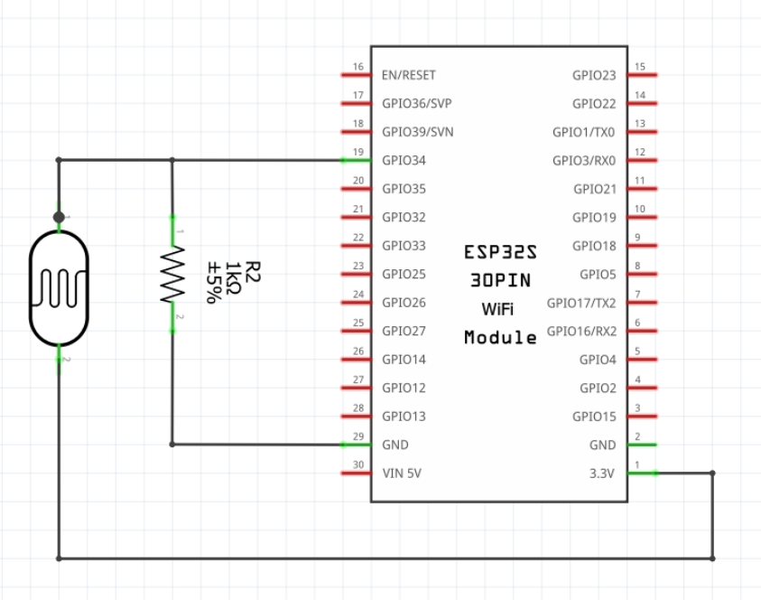
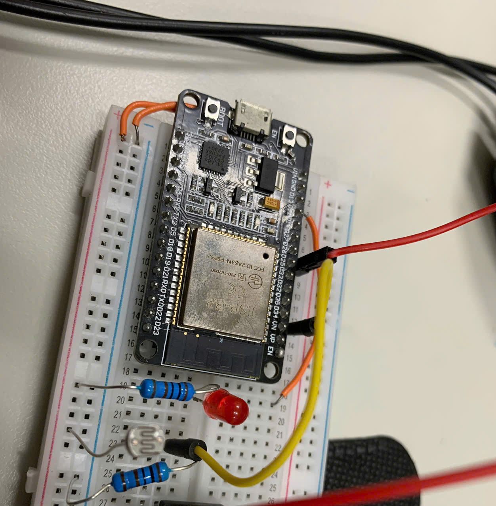
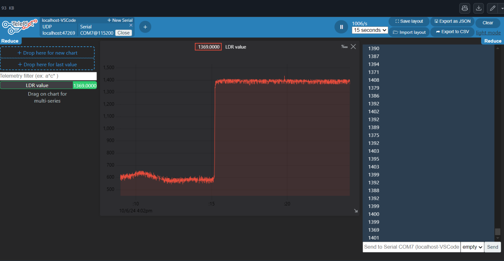

# MÔ TẢ DỰ ÁN ÉP32 VỚI LDR 
Các chức năng đã thực hiện : 
- Đọc giá trị độ sáng từ quang trở
- In giá trị này ra cổng UART dạng số nguyên (0 - 4095)
- Sử dụng công cụ vẽ đồ thị để vẽ đồ thị đo cường độ sáng thu được theo thời gian thực

## Sơ đồ mạch 

## Mạch thực tế

## Kết quả 

